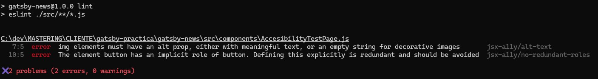

# Práctica GATSBY
Desarrollado por: Claudia Torres Cruz

## Descripción
Esta web es un proyecto de aprendizaje sobre el funcionamiento de Gatsby. Su propósito es generar páginas automáticas que muestran las noticias más recientes de tres categorías principales: deportes, salud y tecnología.

Se utiliza el plugin `gatsby-source-custom-api` para especificar el esquema de la API externa y extraer los datos necesarios.

## Funcionamiento
1. **Extracción de datos**:
   - En el archivo `gatsby-node.js`, se realizan consultas a GraphQL para obtener los datos de las noticias de cada categoría.
   - Cada categoría (deportes, salud, tecnología) se convierte en una página única con una URL dedicada: `/category`.

2. **Creación de páginas**:
   - Con el método `createPage`, se crean tres páginas dinámicas.
   - Se utiliza el componente `NewsTemplate`, enviando como contexto la categoría y los artículos correspondientes.

3. **Visualización de contenido**:
   - En `NewsTemplate`, se calcula el tiempo transcurrido desde la publicación de cada artículo utilizando `useEffect`.
   - La información de las noticias se muestra en la página.

4. **Interactividad**:
   - Se incluye un componente `ShowRatingButton` que implementa el componente `RatingComponent`.
   - Con el contexto `useRatings`, los usuarios pueden calificar los artículos, aunque las calificaciones no persisten entre sesiones.

## Requisitos Previos
- **Node.js**: La versión de Node utilizada es `v22.11.0`. Esta versión está especificada en el archivo `.node-version` para facilitar su gestión con herramientas como `fnm` o similares.
- **API Token**: Es necesario obtener un API Token para usar la API de noticias desde [The News API](https://www.thenewsapi.com/). Este token debe colocarse en un archivo `.env` en la raíz del proyecto, con la siguiente estructura:
  ```env
  API_TOKEN=tu_token_aqui
  ```

## Instalación
Debido a posibles problemas con dependencias de Gatsby, se debe instalar utilizando el siguiente comando:

```bash
npm install --legacy-peer-deps
```

Una vez instaladas las dependencias, ejecutar el proyecto con:

```bash
npm run dev
```

## Comprobación de accesibilidad

Puedes utilizar el siguiente comando para verificar la accesibilidad del sitio:

```
npm run lint
```



## Testing
Se han desarrollado dos pruebas de end-to-end utilizando Cypress. Para ejecutar los tests:

1. Asegúrate de que la aplicación esté en ejecución.
2. Abre Cypress con el siguiente comando:

   ```bash
   npx cypress open
   ```

3. Selecciona la opción **E2E Testing** y elige un navegador compatible (se utilizó Chrome durante el desarrollo).

## Tecnologías Utilizadas
- **Gatsby**: Framework principal para la generación de la web.
- **React**: Para el desarrollo de componentes.
- **Cypress**: Herramienta para pruebas de end-to-end.

## Notas Adicionales
- Se ha configurado un esquema detallado para la API externa.
- La página utiliza componentes reutilizables y un sistema de calificación interactivo.

